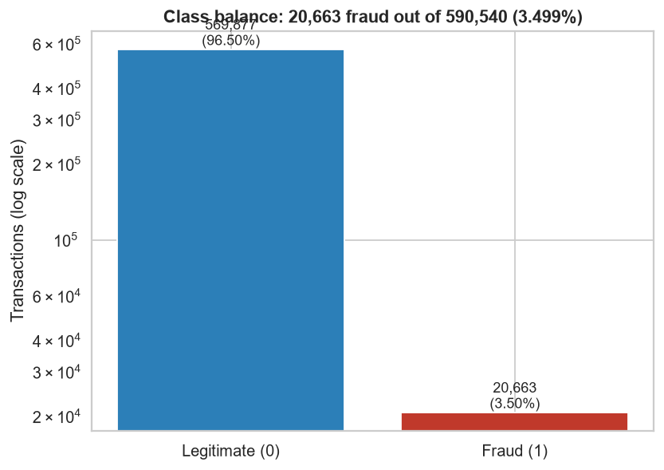

# IEEE-CIS Fraud Detection

An end-to-end machine learning and MLOps project that detects fraudulent card
transactions in the IEEE-CIS dataset, covering the full lifecycle from raw data
to a monitored, containerised, deployed service with an interactive dashboard.

> Status: in progress. Step 1 of 7 complete.

---

## Problem

Card fraud is rare and expensive. Rare, because roughly 3.5% of transactions in
this dataset are fraudulent, so a model that predicts "never fraud" is still
96.5% accurate and completely useless. Expensive, because every missed fraud is
a direct loss and every false alarm annoys a real customer.

The goal is a model that ranks transactions by fraud risk well enough to be
useful at a realistic review capacity, plus the engineering around it that makes
it deployable, observable, and maintainable.

## Dataset

IEEE-CIS Fraud Detection (Kaggle competition, provided by Vesta Corporation).

| Table | Rows | Columns | Notes |
|-------|------|---------|-------|
| `train_transaction` | 590,540 | 394 | Transaction level, contains the `isFraud` label |
| `train_identity` | 144,233 | 41 | Device and identity signals, only for some transactions |
| `test_transaction` | 506,691 | 393 | No label |
| `test_identity` | 141,907 | 41 | No label |

The two training tables join on `TransactionID`. Only about 24% of transactions
have a matching identity record, which is itself a signal.

Data is not stored in this repository. See Quickstart to download it.

## Architecture

_Diagram added in Step 6._

## Quickstart

```bash
# 1. Clone
git clone https://github.com/YOUR_USERNAME/ieee-cis-fraud-detection.git
cd ieee-cis-fraud-detection

# 2. Environment
py -3.11 -m venv .venv
.\.venv\Scripts\Activate.ps1        # Windows
source .venv/bin/activate           # macOS or Linux
pip install -r requirements.txt -r requirements-dev.txt

# 3. Data (requires a Kaggle account that has joined the competition)
kaggle auth login
python scripts/download_data.py
python scripts/verify_data.py
```

## Project structure

_See `docs/PROJECT_STATE.md` for the annotated structure and current status._

## Roadmap

- [x] Step 1: Dataset acquisition, scaffold, repo, environment
- [x] Step 2: Exploratory data analysis and data understanding
- [ ] Step 3: Feature engineering and preprocessing pipeline
- [ ] Step 4: Model training with MLflow experiment tracking
- [ ] Step 5: MLOps layer: CI/CD, testing, model registry, drift monitoring
- [ ] Step 6: Dockerisation and deployment
- [ ] Step 7: Dashboard and portfolio packaging

## Exploratory analysis

Full findings in [`reports/eda_summary.md`](reports/eda_summary.md).



## Results

_Populated in Step 4._

| Metric | Baseline | Best model |
|--------|----------|------------|
| PR-AUC | TBD | TBD |
| ROC-AUC | TBD | TBD |
| Recall at 1% review rate | TBD | TBD |

## Tech stack

Python 3.11, pandas, scikit-learn, LightGBM, XGBoost, CatBoost, MLflow, SHAP,
FastAPI, Docker, GitHub Actions, Streamlit.

## Background

This project is a follow-on to NovaPay, an earlier fraud detection prototype.
NovaPay's dataset contained only 193 fraud cases across 9,940 transactions,
which capped model performance regardless of technique. The pipeline design
patterns carry forward; the data does not.

## Licence

MIT. See `LICENSE`.
